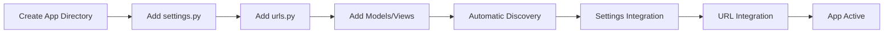

# Modular App System

The modular app system is the core feature of Django SuperApp. It allows you to create fully self-contained Django apps that automatically integrate into your project without manual configuration.

## What is a SuperApp App?

A SuperApp app is a standard Django app enhanced with:

- **Self-contained settings** - `settings.py` with `extend_superapp_settings()` function
- **Self-contained URLs** - `urls.py` with URL extension functions
- **Isolated dependencies** - Optional `requirements.txt` for app-specific packages
- **Automatic discovery** - No manual registration needed

## App Structure

Each app in SuperApp follows a standardized structure:

```
superapp/apps/your_app/
├── settings.py              # App settings integration
├── urls.py                  # App URL integration
├── requirements.txt         # App-specific dependencies (optional)
├── models.py                # Django models
├── views.py                 # Django views
├── admin/                   # Admin configurations
│   └── model_name.py       # One admin file per model
├── migrations/
│   └── __init__.py
├── templates/              # App-specific templates (optional)
│   └── your_app/
├── static/                 # App-specific static files (optional)
│   └── your_app/
└── __init__.py
```

### Required Files

<AccordionGroup>
  <Accordion title="settings.py">
    Contains the `extend_superapp_settings(main_settings)` function that modifies the main project settings.

    ```python
    def extend_superapp_settings(main_settings):
        main_settings['INSTALLED_APPS'] += [
            'superapp.apps.your_app',
        ]
    ```
  </Accordion>

  <Accordion title="urls.py">
    Contains URL extension functions that add routes to the main project.

    ```python
    from django.urls import path
    from superapp.apps.your_app.views import hello_world

    def extend_superapp_urlpatterns(main_urlpatterns):
        main_urlpatterns += [
            path('hello_world/', hello_world),
        ]
    ```
  </Accordion>
</AccordionGroup>

### Optional Files

<AccordionGroup>
  <Accordion title="requirements.txt">
    Lists Python packages specific to this app. These should be installed during deployment if the app is used.

    ```txt
    djangorestframework>=3.14.0
    celery>=5.3.0
    redis>=5.0.0
    ```
  </Accordion>

  <Accordion title="admin/">
    Directory containing admin model configurations. Each model should have its own file.

    ```python filename="admin/sample_model.py"
    from superapp.apps.admin_portal.admin import SuperAppModelAdmin
    from superapp.apps.admin_portal.sites import superapp_admin_site
    from django.contrib import admin
    from ..models import SampleModel

    @admin.register(SampleModel, site=superapp_admin_site)
    class SampleModelAdmin(SuperAppModelAdmin):
        list_display = ['slug', 'name', 'created_at']
        search_fields = ['name', 'slug']
    ```
  </Accordion>
</AccordionGroup>

## Automatic App Discovery and Loading

SuperApp uses Python's built-in module discovery to automatically find and integrate apps. The discovery mechanism is implemented in the core framework files.

### Discovery Process

From `src/django_superapp/settings.py:9-21`:

```python
def extend_superapp_settings(main_settings, superapp_apps):
    for importer, modname, ispkg in pkgutil.iter_modules(superapp_apps.__path__):
        submodule_name = f"{superapp_apps.__name__}.{modname}.settings"

        try:
            settings_module = importlib.import_module(submodule_name)
        except ModuleNotFoundError as e:
            if f"No module named '{submodule_name}'" in str(e):
                continue
            raise e

        if hasattr(settings_module, "extend_superapp_settings"):
            settings_module.extend_superapp_settings(main_settings)
```

#### How It Works

1. **Module Iteration** - `pkgutil.iter_modules()` scans all modules in `superapp/apps/`
2. **Dynamic Import** - Each app's `settings.py` is imported using `importlib.import_module()`
3. **Function Check** - Checks if `extend_superapp_settings()` function exists
4. **Settings Integration** - Calls the function with `main_settings` dictionary
5. **Error Handling** - Gracefully skips apps without `settings.py`

<Note>
  The discovery mechanism only raises exceptions for actual errors (like syntax errors). Missing `settings.py` files are silently skipped, making apps with only URL configurations valid.
</Note>

### URL Discovery

From `src/django_superapp/urls.py:7-19`:

```python
def extend_superapp_urlpatterns(main_urlpatterns, package):
    for importer, modname, ispkg in pkgutil.iter_modules(package.__path__):
        submodule_name = f"{package.__name__}.{modname}.urls"

        try:
            urls_module = importlib.import_module(submodule_name)
        except ModuleNotFoundError as e:
            if f"No module named '{submodule_name}'" in str(e):
                continue
            raise e

        if hasattr(urls_module, "extend_superapp_urlpatterns"):
            urls_module.extend_superapp_urlpatterns(main_urlpatterns)
```

The URL discovery follows the same pattern as settings discovery, providing consistency across the framework.

## Real-World App Examples

Based on the conventions documented in `CONVENTIONS.md:14-28`:

### Basic App Structure

```python filename="superapp/apps/sample_app/settings.py"
def extend_superapp_settings(main_settings):
    main_settings['INSTALLED_APPS'] += ['superapp.apps.sample_app']
```

```python filename="superapp/apps/sample_app/urls.py"
from django.urls import path
from superapp.apps.sample_app.views import hello_world

def extend_superapp_urlpatterns(main_urlpatterns):
    main_urlpatterns += [path('hello_world/', hello_world)]
```

### App with Admin Navigation

From `CONVENTIONS.md:59-81`:

```python filename="superapp/apps/sample_app/settings.py"
from django.utils.translation import gettext_lazy as _
from django.urls import reverse_lazy

def extend_superapp_settings(main_settings):
    main_settings['INSTALLED_APPS'] += ['superapp.apps.sample_app']

    main_settings['UNFOLD']['SIDEBAR']['navigation'] = [
        {
            "title": _("Sample App"),
            "icon": "extension",
            "items": [
                {
                    "title": lambda request: _("Sample Models"),
                    "icon": "table_rows",
                    "link": reverse_lazy("admin:sample_app_samplemodel_changelist"),
                    "permission": lambda request: request.user.has_perm("sample_app.view_samplemodel"),
                },
            ]
        },
    ]
```

### App with Custom Admin

From `CONVENTIONS.md:83-94`:

```python filename="superapp/apps/sample_app/admin/sample_model.py"
from superapp.apps.admin_portal.admin import SuperAppModelAdmin
from superapp.apps.admin_portal.sites import superapp_admin_site
from django.contrib import admin
from ..models import SampleModel

@admin.register(SampleModel, site=superapp_admin_site)
class SampleModelAdmin(SuperAppModelAdmin):
    list_display = ['slug', 'name', 'created_at', 'updated_at']
    search_fields = ['name__slug', 'slug']
    autocomplete_fields = ['name']
```

## App Lifecycle



## Best Practices

<CardGroup cols={2}>
  <Card title="One Concern Per App" icon="bullseye">
    Keep apps focused on a single domain or feature (authentication, blog, API, etc.)
  </Card>
  
  <Card title="Self-Contained" icon="box">
    Apps should be independent and not rely on other SuperApp apps when possible
  </Card>
  
  <Card title="Clear Dependencies" icon="list-check">
    Document all app dependencies in requirements.txt
  </Card>
  
  <Card title="Proper Admin Organization" icon="folder-tree">
    Keep admin files in the admin/ directory with one file per model
  </Card>
</CardGroup>

<Warning>
  Admin configurations must use `superapp_admin_site` from `superapp.apps.admin_portal.sites` and inherit from `SuperAppModelAdmin` to work with the django-unfold UI.
</Warning>

## Conventions Summary

Based on `CONVENTIONS.md`:

- Apps live in `superapp/apps/<app_name>/`
- Settings integration via `extend_superapp_settings(main_settings)`
- URL integration via `extend_superapp_urlpatterns(main_urlpatterns)`
- App-specific dependencies in `requirements.txt`
- Admin files in `superapp/apps/<app_name>/admin/<model_name_slug>.py`
- Use `SuperAppModelAdmin` based on `unfold.admin.ModelAdmin`
- Register admins with `superapp_admin_site`
- Configure sidebar navigation in app's `settings.py` via `UNFOLD['SIDEBAR']['navigation']`

## Next Steps

<CardGroup cols={3}>
  <Card title="Settings Integration" icon="gear" href="/concepts/settings-integration">
    Learn how to configure app settings
  </Card>
  
  <Card title="URL Integration" icon="link" href="/concepts/url-integration">
    Learn how to register app URLs
  </Card>
  
  <Card title="Create Your First App" icon="rocket" href="/quickstart">
    Build your first SuperApp app
  </Card>
</CardGroup>
