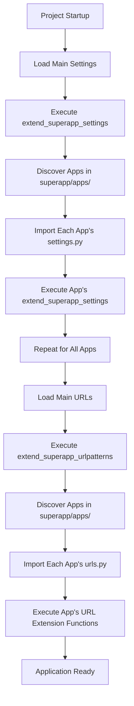

# Architecture Overview

Django SuperApp is a modular framework that extends Django to enable rapid project development through pre-built, standalone apps. The framework provides an automatic discovery and integration system that makes Django projects more organized and scalable.

## Core Architecture

Django SuperApp enhances the standard Django project structure by introducing an automated app discovery and integration mechanism. Instead of manually configuring each app in your project's settings and URLs, SuperApp automatically detects and integrates apps placed in the `superapp/apps/` directory.

### How SuperApp Extends Django

The framework provides two core integration points:

1. **Settings Integration** - Automatically discovers and executes `extend_superapp_settings()` functions from each app's `settings.py`
2. **URL Integration** - Automatically discovers and executes URL extension functions from each app's `urls.py`

This architecture allows each app to be truly self-contained with its own configuration, routes, and dependencies.

## App Discovery Mechanism

SuperApp uses Python's `pkgutil.iter_modules()` to automatically discover all apps within the `superapp/apps/` directory. The discovery process:

1. Iterates through all modules in the apps package
2. Attempts to import `settings.py` and `urls.py` from each app
3. Executes integration functions if they exist
4. Gracefully continues if an app doesn't have these files

### Settings Discovery

From `src/django_superapp/settings.py:9-21`:

```python
def extend_superapp_settings(main_settings, superapp_apps):
    for importer, modname, ispkg in pkgutil.iter_modules(superapp_apps.__path__):
        submodule_name = f"{superapp_apps.__name__}.{modname}.settings"

        try:
            settings_module = importlib.import_module(submodule_name)
        except ModuleNotFoundError as e:
            if f"No module named '{submodule_name}'" in str(e):
                continue
            raise e

        if hasattr(settings_module, "extend_superapp_settings"):
            settings_module.extend_superapp_settings(main_settings)
```

This function:
- Dynamically imports each app's settings module
- Checks if `extend_superapp_settings()` exists
- Passes the main settings dictionary for modification
- Handles missing modules gracefully

### URL Discovery

From `src/django_superapp/urls.py:7-19`:

```python
def extend_superapp_urlpatterns(main_urlpatterns, package):
    for importer, modname, ispkg in pkgutil.iter_modules(package.__path__):
        submodule_name = f"{package.__name__}.{modname}.urls"

        try:
            urls_module = importlib.import_module(submodule_name)
        except ModuleNotFoundError as e:
            if f"No module named '{submodule_name}'" in str(e):
                continue
            raise e

        if hasattr(urls_module, "extend_superapp_urlpatterns"):
            urls_module.extend_superapp_urlpatterns(main_urlpatterns)
```

Similar to settings discovery, this function automatically integrates URL patterns from each app.

## Project Structure Conventions

Django SuperApp follows a standardized project structure:

```
my_superapp/
├── superapp/
│   ├── apps/
│   │   ├── admin_portal/
│   │   │   ├── settings.py          # App-specific settings
│   │   │   ├── urls.py              # App-specific URLs
│   │   │   ├── requirements.txt     # App-specific dependencies
│   │   │   ├── models.py
│   │   │   ├── views.py
│   │   │   └── admin/
│   │   │       └── *.py             # Admin configurations
│   │   ├── authentication/
│   │   │   ├── settings.py
│   │   │   ├── urls.py
│   │   │   ├── requirements.txt
│   │   │   └── ...
│   │   └── your_app/
│   │       ├── settings.py          # Required for settings integration
│   │       ├── urls.py              # Required for URL integration
│   │       ├── requirements.txt     # Optional app dependencies
│   │       └── ...
│   ├── settings.py                  # Main project settings
│   └── urls.py                      # Main project URLs
├── manage.py
└── requirements.txt                 # Project-wide dependencies
```

### Key Conventions

<AccordionGroup>
  <Accordion title="App Location">
    All SuperApp apps must be placed in `superapp/apps/` directory for automatic discovery.
  </Accordion>

  <Accordion title="App Settings">
    Each app should have a `settings.py` with an `extend_superapp_settings(main_settings)` function to configure the app.
  </Accordion>

  <Accordion title="App URLs">
    Each app should have a `urls.py` with `extend_superapp_urlpatterns(main_urlpatterns)` function to register routes.
  </Accordion>

  <Accordion title="App Dependencies">
    Each app can have its own `requirements.txt` for app-specific Python packages.
  </Accordion>

  <Accordion title="Admin Files">
    Admin configurations must live in `superapp/apps/<app_name>/admin/<model_name_slug>.py` for proper organization.
  </Accordion>
</AccordionGroup>

## Benefits of SuperApp Architecture

<CardGroup cols={2}>
  <Card title="Modularity" icon="cube">
    Each app is completely self-contained with its own settings, URLs, and dependencies.
  </Card>
  
  <Card title="Reusability" icon="recycle">
    Apps can be easily shared across projects or published as templates.
  </Card>
  
  <Card title="Automatic Integration" icon="wand-magic-sparkles">
    No manual configuration needed - just drop an app in the apps directory.
  </Card>
  
  <Card title="Scalability" icon="chart-line">
    Add or remove apps without modifying core project files.
  </Card>
</CardGroup>

## Integration Flow

When your Django SuperApp project starts:



<Note>
  The discovery mechanism is fault-tolerant - if an app doesn't have `settings.py` or `urls.py`, it's simply skipped without errors.
</Note>

## Next Steps

<CardGroup cols={2}>
  <Card title="App System" icon="puzzle-piece" href="/concepts/app-system">
    Learn how to structure and create SuperApp apps
  </Card>
  
  <Card title="Settings Integration" icon="gear" href="/concepts/settings-integration">
    Deep dive into app settings integration
  </Card>
  
  <Card title="URL Integration" icon="link" href="/concepts/url-integration">
    Understand URL pattern integration
  </Card>
</CardGroup>
