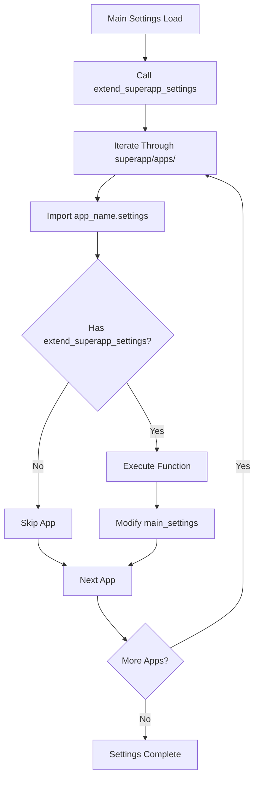

# Settings Integration

Settings integration is one of the core features of Django SuperApp. It allows each app to define and inject its own configuration into the main project settings automatically.

## How Settings Integration Works

When your Django SuperApp project starts, the framework automatically discovers and executes the `extend_superapp_settings()` function from each app's `settings.py` file.

### The extend_superapp_settings Function

The core integration function is defined in `src/django_superapp/settings.py:9-21`:

```python
def extend_superapp_settings(main_settings, superapp_apps):
    for importer, modname, ispkg in pkgutil.iter_modules(superapp_apps.__path__):
        submodule_name = f"{superapp_apps.__name__}.{modname}.settings"

        try:
            settings_module = importlib.import_module(submodule_name)
        except ModuleNotFoundError as e:
            if f"No module named '{submodule_name}'" in str(e):
                continue
            raise e

        if hasattr(settings_module, "extend_superapp_settings"):
            settings_module.extend_superapp_settings(main_settings)
```

### Integration Flow



## Creating App Settings

Each app can define its settings integration by creating a `settings.py` file with the `extend_superapp_settings()` function.

### Basic Example

From `CONVENTIONS.md:14-18`:

```python filename="superapp/apps/sample_app/settings.py"
def extend_superapp_settings(main_settings):
    main_settings['INSTALLED_APPS'] += ['superapp.apps.sample_app']
```

This minimal example adds the app to Django's `INSTALLED_APPS` setting.

### The main_settings Parameter

The `main_settings` parameter is a dictionary containing all of Django's settings. You can modify any setting by directly accessing and updating the dictionary:

```python
def extend_superapp_settings(main_settings):
    # Add to INSTALLED_APPS
    main_settings['INSTALLED_APPS'] += ['superapp.apps.your_app']
    
    # Add middleware
    main_settings['MIDDLEWARE'] += ['superapp.apps.your_app.middleware.CustomMiddleware']
    
    # Update templates
    main_settings['TEMPLATES'][0]['DIRS'] += [
        'superapp/apps/your_app/templates'
    ]
    
    # Add custom settings
    main_settings['YOUR_APP_CUSTOM_SETTING'] = 'value'
```

## Real-World Examples

### Adding INSTALLED_APPS

The most common use case is registering your app with Django:

```python filename="superapp/apps/authentication/settings.py"
def extend_superapp_settings(main_settings):
    main_settings['INSTALLED_APPS'] += [
        'superapp.apps.authentication',
    ]
```

### Configuring django-unfold Admin

From `CONVENTIONS.md:59-81`, apps can configure the admin sidebar navigation:

```python filename="superapp/apps/sample_app/settings.py"
from django.utils.translation import gettext_lazy as _
from django.urls import reverse_lazy

def extend_superapp_settings(main_settings):
    main_settings['INSTALLED_APPS'] += ['superapp.apps.sample_app']

    main_settings['UNFOLD']['SIDEBAR']['navigation'] = [
        {
            "title": _("Sample App"),
            "icon": "extension",  # Material Icons from Google Fonts
            "items": [
                {
                    "title": lambda request: _("Sample Models"),
                    "icon": "table_rows",
                    "link": reverse_lazy("admin:sample_app_samplemodel_changelist"),
                    "permission": lambda request: request.user.has_perm("sample_app.view_samplemodel"),
                },
            ]
        },
    ]
```

<Note>
  Icons are from [Google Material Icons](https://fonts.google.com/icons). The URL pattern name typically follows the format `admin:app_modelname_changelist`.
</Note>

### Adding Multiple Configuration Items

```python filename="superapp/apps/api/settings.py"
def extend_superapp_settings(main_settings):
    # Register app
    main_settings['INSTALLED_APPS'] += [
        'rest_framework',
        'superapp.apps.api',
    ]
    
    # Configure REST Framework
    main_settings['REST_FRAMEWORK'] = {
        'DEFAULT_AUTHENTICATION_CLASSES': [
            'rest_framework.authentication.SessionAuthentication',
        ],
        'DEFAULT_PERMISSION_CLASSES': [
            'rest_framework.permissions.IsAuthenticated',
        ],
        'DEFAULT_PAGINATION_CLASS': 'rest_framework.pagination.PageNumberPagination',
        'PAGE_SIZE': 100,
    }
    
    # Add custom API settings
    main_settings['API_VERSION'] = 'v1'
    main_settings['API_RATE_LIMIT'] = '100/hour'
```

### Configuring Middleware

```python filename="superapp/apps/monitoring/settings.py"
def extend_superapp_settings(main_settings):
    main_settings['INSTALLED_APPS'] += ['superapp.apps.monitoring']
    
    # Add monitoring middleware
    main_settings['MIDDLEWARE'] += [
        'superapp.apps.monitoring.middleware.RequestTimingMiddleware',
        'superapp.apps.monitoring.middleware.ErrorTrackingMiddleware',
    ]
```

### Adding Template Directories

```python filename="superapp/apps/theme/settings.py"
import os

def extend_superapp_settings(main_settings):
    main_settings['INSTALLED_APPS'] += ['superapp.apps.theme']
    
    # Add app templates directory
    app_templates = os.path.join(
        os.path.dirname(__file__), 
        'templates'
    )
    main_settings['TEMPLATES'][0]['DIRS'].append(app_templates)
```

### Configuring Database Connections

```python filename="superapp/apps/analytics/settings.py"
def extend_superapp_settings(main_settings):
    main_settings['INSTALLED_APPS'] += ['superapp.apps.analytics']
    
    # Add additional database for analytics
    main_settings['DATABASES']['analytics'] = {
        'ENGINE': 'django.db.backends.postgresql',
        'NAME': 'analytics_db',
        'USER': 'analytics_user',
        'PASSWORD': 'password',
        'HOST': 'localhost',
        'PORT': '5432',
    }
```

## Advanced Patterns

### Conditional Configuration

```python filename="superapp/apps/debugging/settings.py"
def extend_superapp_settings(main_settings):
    main_settings['INSTALLED_APPS'] += ['superapp.apps.debugging']
    
    # Only enable debug toolbar in development
    if main_settings.get('DEBUG', False):
        main_settings['INSTALLED_APPS'] += ['debug_toolbar']
        main_settings['MIDDLEWARE'] += [
            'debug_toolbar.middleware.DebugToolbarMiddleware'
        ]
```

### Extending Existing Settings

```python filename="superapp/apps/security/settings.py"
def extend_superapp_settings(main_settings):
    main_settings['INSTALLED_APPS'] += ['superapp.apps.security']
    
    # Extend existing CORS settings
    cors_origins = main_settings.get('CORS_ALLOWED_ORIGINS', [])
    cors_origins += [
        'https://api.example.com',
        'https://admin.example.com',
    ]
    main_settings['CORS_ALLOWED_ORIGINS'] = cors_origins
```

### Environment-Based Configuration

```python filename="superapp/apps/email/settings.py"
import os

def extend_superapp_settings(main_settings):
    main_settings['INSTALLED_APPS'] += ['superapp.apps.email']
    
    # Configure email backend based on environment
    if os.getenv('ENVIRONMENT') == 'production':
        main_settings['EMAIL_BACKEND'] = 'django.core.mail.backends.smtp.EmailBackend'
        main_settings['EMAIL_HOST'] = os.getenv('EMAIL_HOST')
    else:
        main_settings['EMAIL_BACKEND'] = 'django.core.mail.backends.console.EmailBackend'
```

## Settings Integration Best Practices

<CardGroup cols={2}>
  <Card title="Use += for Lists" icon="plus">
    Always use `+=` when adding to list settings like `INSTALLED_APPS` or `MIDDLEWARE` to preserve existing values.
  </Card>
  
  <Card title="Check Existing Values" icon="magnifying-glass">
    Use `main_settings.get()` to safely check for existing settings before modifying.
  </Card>
  
  <Card title="Namespace Custom Settings" icon="tag">
    Prefix app-specific settings with your app name to avoid conflicts (e.g., `YOUR_APP_SETTING`).
  </Card>
  
  <Card title="Document Dependencies" icon="book">
    If your settings require third-party packages, document them in `requirements.txt`.
  </Card>
</CardGroup>

## Common Settings to Modify

<AccordionGroup>
  <Accordion title="INSTALLED_APPS">
    Register your app and any required third-party apps.

    ```python
    main_settings['INSTALLED_APPS'] += [
        'rest_framework',
        'superapp.apps.your_app',
    ]
    ```
  </Accordion>

  <Accordion title="MIDDLEWARE">
    Add custom middleware for request/response processing.

    ```python
    main_settings['MIDDLEWARE'] += [
        'superapp.apps.your_app.middleware.CustomMiddleware',
    ]
    ```
  </Accordion>

  <Accordion title="TEMPLATES">
    Configure template directories and context processors.

    ```python
    main_settings['TEMPLATES'][0]['DIRS'] += [
        'superapp/apps/your_app/templates'
    ]
    ```
  </Accordion>

  <Accordion title="UNFOLD (Admin Configuration)">
    Configure django-unfold admin interface and sidebar navigation.

    ```python
    main_settings['UNFOLD']['SIDEBAR']['navigation'] = [...]
    ```
  </Accordion>

  <Accordion title="REST_FRAMEWORK">
    Configure Django REST Framework settings for APIs.

    ```python
    main_settings['REST_FRAMEWORK'] = {
        'DEFAULT_PERMISSION_CLASSES': [...],
    }
    ```
  </Accordion>
</AccordionGroup>

<Warning>
  Be careful when modifying settings that other apps might also modify. Use list operations like `+=` instead of direct assignment to avoid overwriting other apps' configurations.
</Warning>

## Error Handling

The framework handles missing `settings.py` files gracefully:

```python
try:
    settings_module = importlib.import_module(submodule_name)
except ModuleNotFoundError as e:
    if f"No module named '{submodule_name}'" in str(e):
        continue  # App doesn't have settings.py - skip it
    raise e  # Other import errors are raised
```

This means:
- Apps without `settings.py` are silently skipped
- Syntax errors or other import errors will still raise exceptions
- Apps can have only `urls.py` without `settings.py`

## Next Steps

<CardGroup cols={3}>
  <Card title="URL Integration" icon="link" href="/concepts/url-integration">
    Learn how to register app URLs
  </Card>
  
  <Card title="App System" icon="puzzle-piece" href="/concepts/app-system">
    Understand the complete app structure
  </Card>
  
  <Card title="Admin Integration" icon="user-shield" href="/guides/admin-integration">
    Configure admin sidebar navigation
  </Card>
</CardGroup>
