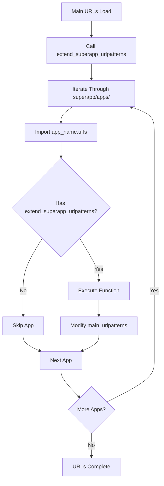

# URL Integration

URL integration allows each SuperApp app to register its own URL patterns automatically. The framework discovers and executes URL extension functions from each app's `urls.py` file during startup.

## How URL Integration Works

Django SuperApp provides two URL integration mechanisms:

1. **Standard URL Patterns** - For regular Django views and endpoints
2. **Admin URL Patterns** - For admin-specific routes (deprecated)

### The extend_superapp_urlpatterns Function

The core URL integration function is defined in `src/django_superapp/urls.py:7-19`:

```python
def extend_superapp_urlpatterns(main_urlpatterns, package):
    for importer, modname, ispkg in pkgutil.iter_modules(package.__path__):
        submodule_name = f"{package.__name__}.{modname}.urls"

        try:
            urls_module = importlib.import_module(submodule_name)
        except ModuleNotFoundError as e:
            if f"No module named '{submodule_name}'" in str(e):
                continue
            raise e

        if hasattr(urls_module, "extend_superapp_urlpatterns"):
            urls_module.extend_superapp_urlpatterns(main_urlpatterns)
```

### Integration Flow



## Creating App URLs

Each app defines its URL integration by creating a `urls.py` file with the `extend_superapp_urlpatterns()` function.

### Basic Example

From `CONVENTIONS.md:22-28`:

```python filename="superapp/apps/sample_app/urls.py"
from django.urls import path
from superapp.apps.sample_app.views import hello_world

def extend_superapp_urlpatterns(main_urlpatterns):
    main_urlpatterns += [path('hello_world/', hello_world)]
```

This simple example adds a single URL pattern to the main project.

### The main_urlpatterns Parameter

The `main_urlpatterns` parameter is a list of Django URL patterns. You can modify it by adding new patterns:

```python
def extend_superapp_urlpatterns(main_urlpatterns):
    main_urlpatterns += [
        path('api/', api_view),
        path('dashboard/', dashboard_view),
        path('settings/', settings_view),
    ]
```

## Real-World URL Integration Examples

### Simple View Registration

```python filename="superapp/apps/blog/urls.py"
from django.urls import path
from superapp.apps.blog.views import (
    post_list,
    post_detail,
    post_create,
)

def extend_superapp_urlpatterns(main_urlpatterns):
    main_urlpatterns += [
        path('blog/', post_list, name='blog_post_list'),
        path('blog/<slug:slug>/', post_detail, name='blog_post_detail'),
        path('blog/create/', post_create, name='blog_post_create'),
    ]
```

### Using include() for Namespaced URLs

```python filename="superapp/apps/api/urls.py"
from django.urls import path, include
from rest_framework.routers import DefaultRouter
from superapp.apps.api.views import UserViewSet, PostViewSet

router = DefaultRouter()
router.register(r'users', UserViewSet)
router.register(r'posts', PostViewSet)

def extend_superapp_urlpatterns(main_urlpatterns):
    main_urlpatterns += [
        path('api/v1/', include((router.urls, 'api'), namespace='api_v1')),
    ]
```

### Class-Based Views

```python filename="superapp/apps/dashboard/urls.py"
from django.urls import path
from superapp.apps.dashboard.views import (
    DashboardView,
    AnalyticsView,
    ReportsView,
)

def extend_superapp_urlpatterns(main_urlpatterns):
    main_urlpatterns += [
        path('dashboard/', DashboardView.as_view(), name='dashboard'),
        path('dashboard/analytics/', AnalyticsView.as_view(), name='analytics'),
        path('dashboard/reports/', ReportsView.as_view(), name='reports'),
    ]
```

### REST Framework ViewSets

```python filename="superapp/apps/store/urls.py"
from django.urls import path, include
from rest_framework.routers import DefaultRouter
from superapp.apps.store.views import ProductViewSet, OrderViewSet

def extend_superapp_urlpatterns(main_urlpatterns):
    router = DefaultRouter()
    router.register(r'products', ProductViewSet, basename='product')
    router.register(r'orders', OrderViewSet, basename='order')
    
    main_urlpatterns += [
        path('store/', include(router.urls)),
    ]
```

### URLs with Authentication

```python filename="superapp/apps/account/urls.py"
from django.urls import path
from django.contrib.auth.decorators import login_required
from superapp.apps.account.views import (
    ProfileView,
    SettingsView,
    ChangePasswordView,
)

def extend_superapp_urlpatterns(main_urlpatterns):
    main_urlpatterns += [
        path('account/profile/', login_required(ProfileView.as_view()), name='profile'),
        path('account/settings/', login_required(SettingsView.as_view()), name='settings'),
        path('account/password/', ChangePasswordView.as_view(), name='change_password'),
    ]
```

## Admin URL Integration

### The extend_superapp_admin_urlpatterns Function

From `src/django_superapp/urls.py:22-34`:

```python
def extend_superapp_admin_urlpatterns(main_admin_urlpatterns, package):
    for importer, modname, ispkg in pkgutil.iter_modules(package.__path__):
        submodule_name = f"{package.__name__}.{modname}.urls"

        try:
            urls_module = importlib.import_module(submodule_name)
        except ModuleNotFoundError as e:
            if f"No module named '{submodule_name}'" in str(e):
                continue
            raise e

        if hasattr(urls_module, "extend_superapp_admin_urlpatterns"):
            urls_module.extend_superapp_admin_urlpatterns(main_admin_urlpatterns)
```

<Warning>
  The `extend_superapp_admin_urlpatterns` function is **deprecated** and will be removed soon. The admin URL patterns are now generated in `admin_portal/sites.py`.
</Warning>

### Legacy Admin URL Example

```python filename="superapp/apps/custom_admin/urls.py"
from django.urls import path
from superapp.apps.custom_admin.views import custom_admin_view

# DEPRECATED: Use admin_portal/sites.py instead
def extend_superapp_admin_urlpatterns(main_admin_urlpatterns):
    main_admin_urlpatterns += [
        path('custom-admin/', custom_admin_view, name='custom_admin'),
    ]
```

## Advanced URL Patterns

### Regular Expressions

```python filename="superapp/apps/content/urls.py"
from django.urls import re_path
from superapp.apps.content.views import content_view

def extend_superapp_urlpatterns(main_urlpatterns):
    main_urlpatterns += [
        re_path(r'^content/(?P<year>[0-9]{4})/(?P<month>[0-9]{2})/$', content_view),
    ]
```

### URL Converters

```python filename="superapp/apps/articles/urls.py"
from django.urls import path
from superapp.apps.articles.views import article_by_id, article_by_slug

def extend_superapp_urlpatterns(main_urlpatterns):
    main_urlpatterns += [
        path('articles/<int:article_id>/', article_by_id),
        path('articles/<slug:slug>/', article_by_slug),
        path('articles/<uuid:uuid>/', article_by_uuid),
    ]
```

### Nested URL Patterns

```python filename="superapp/apps/ecommerce/urls.py"
from django.urls import path, include

def extend_superapp_urlpatterns(main_urlpatterns):
    product_patterns = [
        path('', product_list, name='product_list'),
        path('<int:pk>/', product_detail, name='product_detail'),
        path('<int:pk>/reviews/', product_reviews, name='product_reviews'),
    ]
    
    main_urlpatterns += [
        path('shop/products/', include(product_patterns)),
    ]
```

### API Versioning

```python filename="superapp/apps/api/urls.py"
from django.urls import path, include

def extend_superapp_urlpatterns(main_urlpatterns):
    # API v1
    main_urlpatterns += [
        path('api/v1/', include('superapp.apps.api.v1.urls')),
    ]
    
    # API v2
    main_urlpatterns += [
        path('api/v2/', include('superapp.apps.api.v2.urls')),
    ]
```

## URL Integration Best Practices

<CardGroup cols={2}>
  <Card title="Use Named URLs" icon="tag">
    Always provide `name` parameter for URL patterns to enable reverse URL resolution.
  </Card>
  
  <Card title="Namespace Your URLs" icon="folder">
    Use URL namespaces to avoid naming conflicts between apps.
  </Card>
  
  <Card title="Consistent Path Prefix" icon="route">
    Use a consistent prefix for all URLs in an app (e.g., `blog/`, `api/`).
  </Card>
  
  <Card title="RESTful Conventions" icon="sitemap">
    Follow REST conventions for API endpoints when applicable.
  </Card>
</CardGroup>

## URL Pattern Order

<Warning>
  Django processes URL patterns in order. More specific patterns should come before more general ones.
</Warning>

```python
# Good - specific before general
main_urlpatterns += [
    path('blog/create/', post_create),      # Specific
    path('blog/<slug:slug>/', post_detail), # General
]

# Bad - general before specific
main_urlpatterns += [
    path('blog/<slug:slug>/', post_detail), # Will match 'create' as a slug!
    path('blog/create/', post_create),      # Never reached
]
```

## Complete URL Integration Wrapper

From `src/django_superapp/urls.py:40-43`:

```python
def extend_with_superapp_urlpatterns(main_urlpatterns, superapp_apps):
    extend_superapp_urlpatterns(main_urlpatterns, superapp_apps)
    # The below function is deprecated and will be removed soon
    extend_superapp_admin_urlpatterns(main_admin_urlpatterns, superapp_apps)
```

This wrapper function calls both standard and admin URL integration functions. Your main project URLs file would use this:

```python filename="superapp/urls.py"
from django.contrib import admin
from django.urls import path
from django_superapp.urls import extend_with_superapp_urlpatterns
import superapp.apps

urlpatterns = [
    path('admin/', admin.site.urls),
]

# Automatically add all app URLs
extend_with_superapp_urlpatterns(urlpatterns, superapp.apps)
```

## Error Handling

The framework handles missing `urls.py` files gracefully:

```python
try:
    urls_module = importlib.import_module(submodule_name)
except ModuleNotFoundError as e:
    if f"No module named '{submodule_name}'" in str(e):
        continue  # App doesn't have urls.py - skip it
    raise e  # Other import errors are raised
```

This means:
- Apps without `urls.py` are silently skipped
- Syntax errors or other import errors will still raise exceptions
- Apps can have only `settings.py` without `urls.py`

## Testing Your URLs

You can list all registered URL patterns using Django management commands:

```bash
# List all URL patterns (if you have django-extensions)
python manage.py show_urls

# Or use the SuperApp command
docker-compose exec web python3 manage.py list_all_urls_patterns
```

Example output:
```
^portal/^authentication/user/<id>/password/   (name=auth_user_password_change)
^portal/^authentication/user/   (name=authentication_user_changelist)
^blog/   (name=blog_post_list)
^blog/<slug:slug>/   (name=blog_post_detail)
```

## Common URL Patterns

<AccordionGroup>
  <Accordion title="CRUD Operations">
    ```python
    main_urlpatterns += [
        path('items/', item_list, name='item_list'),
        path('items/create/', item_create, name='item_create'),
        path('items/<int:pk>/', item_detail, name='item_detail'),
        path('items/<int:pk>/edit/', item_edit, name='item_edit'),
        path('items/<int:pk>/delete/', item_delete, name='item_delete'),
    ]
    ```
  </Accordion>

  <Accordion title="REST API Endpoints">
    ```python
    from rest_framework.routers import DefaultRouter
    
    router = DefaultRouter()
    router.register(r'resources', ResourceViewSet)
    
    main_urlpatterns += [
        path('api/', include(router.urls)),
    ]
    ```
  </Accordion>

  <Accordion title="Authentication URLs">
    ```python
    from django.contrib.auth import views as auth_views
    
    main_urlpatterns += [
        path('login/', auth_views.LoginView.as_view(), name='login'),
        path('logout/', auth_views.LogoutView.as_view(), name='logout'),
        path('password-reset/', auth_views.PasswordResetView.as_view(), name='password_reset'),
    ]
    ```
  </Accordion>

  <Accordion title="Static/Media Files in Development">
    ```python
    from django.conf import settings
    from django.conf.urls.static import static
    
    if settings.DEBUG:
        main_urlpatterns += static(settings.MEDIA_URL, document_root=settings.MEDIA_ROOT)
    ```
  </Accordion>
</AccordionGroup>

## Next Steps

<CardGroup cols={3}>
  <Card title="Settings Integration" icon="gear" href="/concepts/settings-integration">
    Learn how to configure app settings
  </Card>
  
  <Card title="App System" icon="puzzle-piece" href="/concepts/app-system">
    Understand the complete app structure
  </Card>
  
  <Card title="Create Your First App" icon="rocket" href="/quickstart">
    Build your first SuperApp app
  </Card>
</CardGroup>
